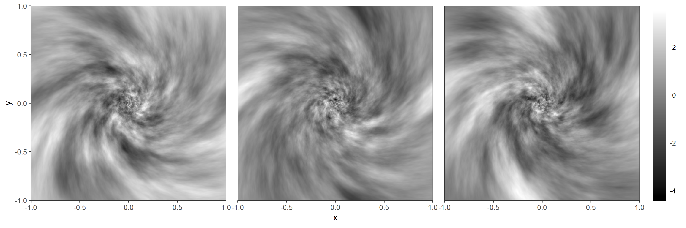

# GRFics


GRFics is an R library for efficient generation and interpolation of noise functions from two-dimensional Gaussian random fields (GRFs). 
What does this actually mean? 
Check out ["What is GRFics useful for?"](#what-is-grfics-useful-for), then  [the examples below](#examples-of-usage).
The [technical details](#technical-details) behind the method are also described.

The package aims to be simple to use, even for those without a background in statistics. 

At the moment, GRFics exists only as an R library.
A Python port might come sometime in the future.

## Installation
The package can be installed by using the function `install_github` from the `devtools` library:

``` r
devtools::install_github("mathiasisaksen/GRFics")
```
## What is GRFics useful for?
#### Noise functions
When creating generative art and visualizations, noise functions are a powerful tool for obtaining interesting and complex behaviour.
The plots below show examples of what two-dimensional noise functions can look like.


The term "noise function" needs some explanation.
While the term "noise" is often associated with something resembling TV static, which is completely unstructured, the above functions look reasonably smooth and nice.
A noise function is, simply put, a function that is generated from some random process.
The underlying random process is what determines whether the resulting noise functions are nice and smooth, or jagged and discontinuous.

#### Random vector fields
Noise functions can be used for many things.
One interesting application is generating random vector fields, which again can be used to [create](https://pierpaololucarelli.com/2018/02/09/java-perlin-noise-visualisation/) [cool flow field visualisations](https://tylerxhobbs.com/essays/2020/flow-fields).
Three random vector fields are shown below, corresponding to the noise functions above.
The direction of each arrow is given by the value of the noise function at the middle of the arrow.
<p align="center">

</p>
The direction is measured in radians, and the noise functions have been rescaled to values between 0 and 2π ≈ 6.28 radians (in other words, 0° and 360°).

#### GRFics as an alternative
Two of the most commonly utilized noise functions are [Perlin](https://en.wikipedia.org/wiki/Perlin_noise) and [simplex noise](https://en.wikipedia.org/wiki/Simplex_noise).
Variations of these have been used for nearly 40 years, both in animation films and video games ([Minecraft uses 3D Perlin noise for terrain generation!](https://notch.tumblr.com/post/3746989361/terrain-generation-part-1)).
The library `GRFics` offers an alternative to these approaches, using two-dimensional Gaussian random fields (GRFs).

Like Perlin/simplex noise, `GRFics` generates noise functions on a regular grid/square lattice over some rectangular region.
This means that, if a grid with `m` rows and `n` columns is used, the values in the `m*n` grid centers are generated.
When a noise function is evaluated in an arbitrary location, e.g. between grid centers, interpolation is used to obtain an approximate value.
`GRFics` offers three interpolation methods to choose between: Nearest-neighbor, bilinear and bicubic.

The approach used in `GRFics` leads to noise functions that are periodic along the horizontal and vertical boundaries of the rectangular region.
In many cases, this can be a useful feature.
If periodicity is not desired, the easiest solution is to use a larger domain than needed.

#### Stationary/non-stationary
The package differentiates between stationary and non-stationary GRFs.
In essence, noise functions from stationary GRFs tend to have the same behaviour everywhere, and look similar to those generated by Perlin/simplex noise.
Examples of noise functions from a stationary GRF are shown in the plots above.
With non-stationary GRFs, we can generate noise functions with more complex features, like the ones below:

<p align="center">
  
</p>

In the area around the origin (0, 0), the functions are non-smooth and chaotic.
As we move outwards, they become smoother, and the functions seem to flow in a spiral.
With `GRFics`, non-stationary GRFs are easily specified through parameters that influence the generated noise functions in an intuitive manner.

To get more intuition on the difference between stationary and non-stationary GRFs, and how `GRFics` can be used to create visualizations, check out the [examples of usage](#examples-of-usage).

## Examples of usage
This section demonstrates how `GRFics` can be used to create visualizations, for both stationary and non-stationary GRFs.
The most important functions are explained in detail.
### Stationary GRF
Below we use noise functions from a stationary GRF in `GRFics` together with `ggplot2` to create this simple generative art piece:

<p align="center">
  
</p>

#### `generate.grf.object` and noise functions
We start by importing the necessary libraries:
``` r
library(GRFics) # For Gaussian random fields
library(ggplot2) # For creating visualizations
library(cowplot) # For theme_nothing
```

Next, two GRF objects are created using the `generate.grf.object` function. Since we are going to make a square image, we'll use the square [-1, 1]^2 as our workspace and define the GRFs on a 100 x 100 grid/lattice. 

``` r
grf.object.1 = generate.grf.object(
  x.lower = -1, x.upper = 1,
  y.lower = -1, y.upper = 1,
  resolution.x = 100, resolution.y = 100,
  range.parameter = 0.5,
  strength.parameter = 0, direction.parameter = 0,
  function.names = c("direction", "length"),
  initial.seed = 0)

grf.object.2 = generate.grf.object(
  x.lower = -1, x.upper = 1,
  y.lower = -1, y.upper = 1,
  resolution.x = 100, resolution.y = 100,
  range.parameter = 0.1,
  strength.parameter = 1, direction.parameter = pi/4,
  function.names = c("direction", "length"),
  initial.seed = 0)
```
Two functions, named "direction" and "length", are added to each object. 
The names don't matter, but are useful for indicating purpose and keeping track. 
Note that functions can also be added manually after the GRF object has been created, using `add.grf.function` and `add.multiple.grf.functions`.

The objects differ on the parameters `range.parameter`, `strength.parameter`, and `direction.parameter`, which are explained below. 
For the sake of comparison, we let `initial.seed = 0`.
This is the starting value of the seed used when generating the noise functions.

In order to get an idea of what we're dealing with, we'll show what the four functions look like.
First, we use `get.function.df` to obtain data frames for plotting:
``` r
grf.1.df = get.function.df(grf.object.1, all.functions = TRUE)
grf.2.df = get.function.df(grf.object.2, all.functions = TRUE)
```
 The output from this function is data frame containing four columns: `x`, `y`, `z`, and `name`:
 ``` r
      x     y         z  name
1 -0.99 -0.99 1.0849532 direction
2 -0.97 -0.99 1.2337742 direction
3 -0.95 -0.99 1.2259580 direction
4 -0.93 -0.99 1.3876447 direction
5 -0.91 -0.99 1.2294589 direction
6 -0.89 -0.99 0.8427565 direction
⋮              ⋮              ⋮
```
 Each row corresponds to a grid cell in the 100 x 100 grid. 
 `x` and `y` are the coordinates of the cell center, and `z` is the value of the noise function in the grid cell. 
 When `all.functions = TRUE`, the result is a data frame containing the values of every function in the object.
 As a result, we need the column `name` to differentiate between rows belonging to different functions.

Next, we plot the functions side-by-side using `ggplot2::geom_raster`.
By adding a column `facet` to both data frames, we can use `ggplot2::facet_grid` to plot the noise functions in a grid.

``` r
grf.1.df$facet = 1
grf.2.df$facet = 2

ggplot()+
  geom_raster(data = rbind(grf.1.df, grf.2.df), aes(x = x, y = y, fill = z))+
  facet_grid(rows = vars(facet), cols = vars(name))+
  scale_fill_gradient(low = "black", high = "white")

```
<p align="center">

</p>

The top row shows the functions from the first GRF object, while the bottom row shows those from the second object.
Functions that are generated from the same GRF look similar in nature.

Based on these plots, we can try to give some intuition on how the parameters `range.parameter`, `strength.parameter`, and `direction.parameter` affect the noise functions.
`range.parameter` determines how fast the functions vary in value. 
A small range leads to something resembling white noise.
Increasing it, however, gives smoother functions.
The difference between 0.5 and 0.1 is clear, as seen in the plots.

`strength.parameter` and `direction.parameter` are best understood by considering the lower right plot.
In this function, there seems to be less variation along the direction given by the red line, when compared to the direction along the blue line.
In fact, the range is `1 + strength.parameter` times longer along the red arrow, and the direction that the arrow forms with the x-axis is given by `direction.parameter`. It is measured in radians, and `pi/4 radian = 45 degrees`.
The range along the blue arrow is `range.parameter = 0.1`, which means that the range along the red arrow is `(1+strength.parameter)*range.parameter = 0.2`.

To sum up: `range.parameter` controls how fast the functions vary in value.
`strength.parameter` and `direction.parameter` are used to make the functions vary slower along a given direction.

#### `evaluate.grf`
So far, we have only looked at the values of the functions on the regular grids that the GRFs are defined on.
Usually, we are interested in evaluating the noise functions in arbitrary locations.
In `GRFics`, this is done with the function `evaluate.grf`.
It takes in
* `locations`: A data frame containing the locations to evaluate. If `locations` has columns named `x` and `y`, these are used for the x- and y-coordinates of the locations. Otherwise, the first 2 columns are used
* `grf.object`: The GRF object that contains the noise function we want to evaluate
* `function.name, function.number`: The name or number of the function in the GRF object
* `periodic`: What should happen with locations that are outside the rectangle the GRF is defined on?
If `FALSE`, these are mapped to the nearest location on the boundary of the rectangle.
If `TRUE` (default), the locations are mapped inside the rectangle in a periodic manner. For example, if the rectangle is [0, 1]^2, the point (1.2, 1.2) is mapped to (0.2, 0.2).
* `interpolation.method`: Which interpolation method to use (`nearest`, `bilinear` or `bicubic` (default))
* `rescale.method`: Which rescaling method to use (`none`, `minmax` (default) or `uniform`)
* `return.df`: Whether to return a vector of interpolated values (`FALSE`, default), or a 3-column data frame that also contains the x- and y-coordinates from `locations` (`TRUE`)

For this next part, we focus only on the first GRF from above.
It is originally defined on a 100 x 100 grid over the square [-1, 1]^2.
To demonstrate `evaluate.grf`, we evaluate the noise function called `direction` over a 300 x 300 grid on the same square, and compare with the original grid. 
Default values are used for `periodic` and `interpolation.method`.

``` r
original.df = get.function.df(grf.object.1, function.names = "direction")
original.df$name = "Original 100 x 100"

interp.grid = generate.grid.centers(x.lower = -1, x.upper = 1, 
                                    y.lower = -1, y.upper = 1, 
                                    resolution.x = 300, resolution.y = 300)
interp.df = evaluate.grf(locations = interp.grid,
                         grf.object = grf.object.1,
                         function.name = "direction",
                         rescale.method = "none", 
                         return.df = TRUE)
interp.df$name = "Interpolation 300 x 300"

ggplot()+
  geom_raster(data = rbind(original.df, interp.df), 
              aes(x = x, y = y, fill = z))+
  facet_wrap(vars(name))+
  scale_fill_gradient(low = "black", high = "white")
```

<p align="center">

</p>

The interpolated values preserve the structure in the original data, while giving a smooth approximation in locations between the cells in the 100 x 100 grid.

Next, we focus on the parameter choices for `rescale.method`.
If `rescale.method = "none"`, then no rescaling is applied to the interpolated values.
The choice `rescale.method = "minmax"` rescales the values to the interval [0, 1] through min-max normalization:
If `m` and `M` are the minimum and maximum values of the noise function on the original grid, then the interpolated value `v` is rescaled to `(v - m)/(M - m)`.

The last option, `rescale.method = "uniform"`, is a bit more involved.
This approach rescales the value to the interval [0, 1], and attempts to make every value equally represented ("uniformly distributed").
The usefulness of this is illustrated later.


<details>
  <summary>Expand this for technical details about the uniform rescaling</summary>
  <div style="color:#fafafa;background-color:#333333;padding:10px;border-radius:15px">
  
  The basis for this approach is the following result:
  If `X` is a random variable with cumulative distribution function (CDF) `F`, then `F(X)` is uniformly distributed on [0, 1].

  If we think of the interpolated value `v` as a random variable with CDF `F`, we can rescale it by computing `F(v)`.
  Since `F` is unknown, we approximate it using the empirical cumulative distribution function (ECDF) of the values on the original grid.
  If a grid of size M x N is used, then the ECDF takes on at most `M*N + 1` different values.

  The ECDF is a monotonically increasing function:
  If `u` and `v` are interpolated values with `u <= v`, then `F(u) <= F(v)`.
  </div>
</details>


Below, histograms of the interpolated values from the different rescaling methods are shown.
<!--``` r 
original.grid = grf.object.1$grid
interpolation.by.method = function(method) {
  evaluate.grf(original.grid, grf.object.1, 
               function.name = "direction", 
               rescale.method = method)
}
unscaled.df = data.frame(values = interpolation.by.method("none"),
                         method = "none")
minmax.df = data.frame(values = interpolation.by.method("minmax"),
                       method = "minmax")
uniform.df = data.frame(values = interpolation.by.method("uniform"),
                        method = "uniform")
ggplot()+
  geom_histogram(data = rbind(unscaled.df, minmax.df, uniform.df), 
                 aes(x = values, y = stat(ndensity)))+
  labs(x = "Interpolated value", y = "Normalized density")+
  facet_wrap(vars(method), scales = "free_x")
```-->

<p align="center">

</p>

With `"none"`, the histogram is clearly bell-shaped.
The values range from around -2 to 3, and the center is at about 0.5.
Using `minmax` leads to a histogram with the same shape, but the values are contained in [0, 1].
Finally, `uniform` has a histogram that is also contained in [0, 1], but the values are approximately uniform.

To illustrate how `uniform` affects the interpolated values, we compare it with `minmax`:

<p align="center">

</p>

Using `uniform` changes the look of the noise function somewhat, but preserves the main features.

Note: When `nearest` or `bilinear` are used for `interpolation.method`, the interpolated value `v` is guaranteed to satisfy `m <= v <= M`, which means that `0 <= (v - m)/(M - m) <= 1`.
This is not true for `bicubic`.
If `interpolation.method = "bicubic"` and `rescale.method = "minmax"` are used together, the interpolated values are therefore not guaranteed to be between 0 and 1.

#### Creating a simple generative piece
Now that we have covered the most important functionality in `GRFics`, we'll use it to create the piece shown in the start of the section.
This is a typical example of how vector/flow fields can be used to create generative art, as explained in [this great article by Tyler Hobbs](https://tylerxhobbs.com/essays/2020/flow-fields).
The process can be boiled down to the following recipe:

1. Start with a certain number of points in random or manually chosen locations
2. Make small increments in time, and move the points according to a vector field
3. Repeat 2 for as long as needed
4. Draw the evolution of each point as a line

For our piece, we'll start with 1000 points evenly distributed on a circle. 
The circle is centered in the origin (0, 0), and has a radius of 0.5.
This can be parametrized as `(x(t), y(t)) = (0.5cos(t), 0.5sin(t))`, where `t` goes from 0 to 2π.
The following code sets up the initial state:
``` r
number.of.points = 1000
theta = seq(0, 2*pi, length.out = number.of.points + 1)[-1]
current.step.df = data.frame(x = 0.5*sin(theta),
                             y = 0.5*cos(theta),
                             group = 1:number.of.points)
cumulative.df = current.step.df
```
Here, `seq` is used to give us `number.of.points + 1` values evenly distributed between 0 and 2π.
Since 0 and 2π correspond to the same point, the former is removed, and we are left with `number.of.points` values.
The data frame `current.step.df` has 3 columns: the x- and y-coordinate of each point, and a column named `group`, which gives each point a unique number.
The data frame `cumulative.df` will be used to store every version of `current.step.df`, as the latter changes with each time increment.
In the end, we can use `cumulative.df` to draw a line for each `group` value.

Next, we need a vector field that the points can flow along.
A vector with a given direction and length can be decomposed into x- and y-components as `(v.x, v.y) = (length*cos(direction), length*sin(direction))`, where `direction` is between 0 and 2π and `length` is non-negative.
Below, we define the function `evaluate.vector.field`, which takes in a matrix/data frame containing the locations of the points, and uses `grf.object.2` from above to compute a vector for each location.

``` r
evaluate.vector.field = function(locations) {
  direction = 2*pi*evaluate.grf(locations, grf.object.2,
                        function.name = "direction", 
                        rescale.method = "uniform")
  length = evaluate.grf(locations, grf.object.2,
                        function.name = "length",
                        interpolation.method = "bilinear",
                        rescale.method = "minmax")
  vector.df = data.frame(v.x = length*cos(direction),
                         v.y = length*sin(direction))
  return(vector.df)
}
```
The functions `direction` and `length` in `grf.object.2` are used to determine the direction and length of each vector, where the first is multiplied by 2π to get directions between 0 and 2π radians.
By using `rescale.method = "uniform"` for `direction`, the direction of the vector field is evenly distributed in all directions:
<p align="center">

</p>

In the above plot, the length of the vectors have been scaled by a factor of 0.1.
If `rescale.method = "minmax"` had been used for `direction`, there would likely be a disproportionate amount of vectors pointing towards the left.

Now that the vector field is ready, we can start moving the points.
We'll use a time increment `dt` equal to 0.05, and run the process for 100 steps:
``` r
dt = 0.05
for (i in 1:100) {
  vector.df = evaluate.vector.field(current.step.df)
  current.step.df[, c("x", "y")] = 
          current.step.df[, c("x", "y")] + vector.df[, c("v.x", "v.y")]*dt
  cumulative.df = rbind(cumulative.df, current.step.df)
}
```

Both the size of `dt` and the number of steps were chosen through experimentation.
The function `rbind` stacks two matrices/data frames on top of each other.
Lets show the path of the first point, which is obtained by extracting the rows in `cumulative.df` where `group` is equal to 1:
``` r
ggplot()+
  theme_bw()+
  geom_path(data = subset(cumulative.df, group == 1), 
            aes(x = x, y = y))+
  coord_fixed()
```
<p align="center">

</p>
The path starts close to (0.5, 0), and finished around (0.25, -0.05).
Luckily, the finished piece looks more interesting:

``` r
ggplot()+
  theme_nothing()+
  geom_path(data = cumulative.df, aes(x = x, y = y, group = group))+
  coord_fixed(xlim = c(-1, 1), ylim = c(-1, 1))
```

<p align="center">

</p>

Very cool!
`theme_nothing` from the `cowplot` library removes everything (axes, labels, etc.), except the plot area.

### Non-stationary GRF
Example coming soon.
<!---This next example is a bit more complicated than the stationary example.

<p align="center">

</p>
--->
## Technical details
The approach utilized was first described in Lindgren et al. (2011), where a stochastic partial differential equation (SPDE) is discretized to obtain a Gaussian Markov random field (GMRF). 
This package implements the variation of the approximation derived in  Fuglstad et al. (2015), where the SPDE is defined on a rectangular region and discretized on a regular grid. 
A periodic boundary condition is used, leading to noise functions that are periodic along the vertical and horizontal boundaries.

## References
Finn Lindgren, Håvard Rue, and Johan Lindström. "An explicit link between Gaussian fields and Gaussian markov random fields: the stochastic partial differential equation approach." *Journal of the Royal Statistical Society: Series B
(Statistical Methodology)*, 73(4):423–498, 2011.

Geir-Arne Fuglstad, Finn Lindgren, Daniel Simpson, and Håvard Rue. "Exploring a new class of non-stationary spatial Gaussian random fields with varying local anisotropy." *Statistica Sinica*, pages 115–133, 2015.
